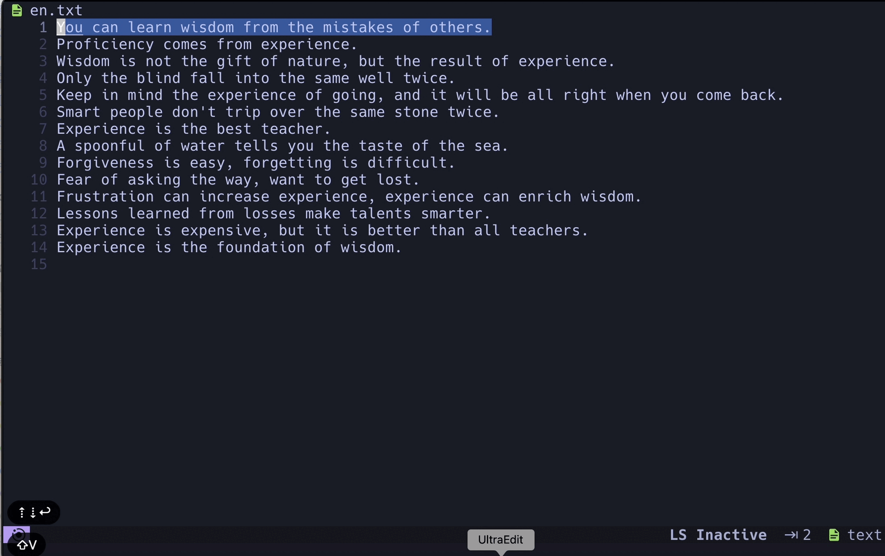

# nvim-translator
A language translator for neovim written in Lua


## Requirements

- Neovim 0.8 or above 
- python3
- python3 googletrans library

```shell
pip3 install googletrans==4.0.0rc1
```

## Installation 

### lazy as plugin manager
- Use default configuration 
```shell

{
    "alix2013/nvim-translator",
    config = function()
        require("nvim-translator").setup({ })
    end
}

```

- Customized configuration

```shell

  {
    "alix2013/nvim-translator",
    config = function()
      require("nvim-translator").setup({
        style = "float",
        https_proxy = "http://localhost:8118",
        keymap = {
          ["tc"] = "zh-cn",
          ["te"] = "en",
          ["ts"] = "es",
          ["td"] = "de",
          ["tk"] = "ko",
          ["tj"] = "ja",
        },
      })
    end

```

### packer as plugin manager
- Use default configuration

```shell

use({
    "alix2013/nvim-translator",
    config = function()
        require("nvim-translator").setup({ })
    end
})

```

- Customized configuration

```shell

use({
    "alix2013/nvim-translator",
    config = function()
        require("nvim-translator").setup({
        style = "float",
        https_proxy = "http://localhost:8118",
        keymap = {
          ["tc"] = "zh-cn",
          ["te"] = "en",
          ["ts"] = "es",
          ["td"] = "de",
          ["tk"] = "ko",
          ["tj"] = "ja",
        })
    end
})

```

## Configuration options

### style 
where to show the translated text, available value: "float", "horizontal", "vertical", default is "float"

| Value   | Description    |
|--------------- | --------------- |
| float   | show in popuped  window   |
| horizontal   | show in bottom window   |
| vertical   | show in right window   |


### https_proxy
Configure proxy if network can not access internet directly, default is "", it
may use current shell environment HTTPS_PROXY if not configure this option

### keymap 
Configure visual mode keymap to translate selected text to destination
language, the following is default configuration, add new item as per requirements

```shell
          ["tc"] = "zh-cn",
          ["te"] = "en",
          ["ts"] = "es",
          ["td"] = "de",
          ["tk"] = "ko",
          ["tj"] = "ja",

```

## Usage

### Translate selected text in visual mode 
- Press V to go to visual mode
- Move cursor to select lines
- Press hot-key to translate selected text to destination language, i.e tc( tc is default keymap to translate text to Chinese )

### Translate selected text using command 
- Press V to go to visual mode
- Move cursor to select lines
- Press :Translate <language abbreviation>, i.e :Translate zh-cn, translate selected text to Chinese

If no text selected, it will translate all text in current buffer window.

## Supported destination language
language abbreviation and language name
```shell

    'af': 'afrikaans',
    'sq': 'albanian',
    'am': 'amharic',
    'ar': 'arabic',
    'hy': 'armenian',
    'az': 'azerbaijani',
    'eu': 'basque',
    'be': 'belarusian',
    'bn': 'bengali',
    'bs': 'bosnian',
    'bg': 'bulgarian',
    'ca': 'catalan',
    'ceb': 'cebuano',
    'ny': 'chichewa',
    'zh-cn': 'chinese (simplified)',
    'zh-tw': 'chinese (traditional)',
    'co': 'corsican',
    'hr': 'croatian',
    'cs': 'czech',
    'da': 'danish',
    'nl': 'dutch',
    'en': 'english',
    'eo': 'esperanto',
    'et': 'estonian',
    'tl': 'filipino',
    'fi': 'finnish',
    'fr': 'french',
    'fy': 'frisian',
    'gl': 'galician',
    'ka': 'georgian',
    'de': 'german',
    'el': 'greek',
    'gu': 'gujarati',
    'ht': 'haitian creole',
    'ha': 'hausa',
    'haw': 'hawaiian',
    'iw': 'hebrew',
    'he': 'hebrew',
    'hi': 'hindi',
    'hmn': 'hmong',
    'hu': 'hungarian',
    'is': 'icelandic',
    'ig': 'igbo',
    'id': 'indonesian',
    'ga': 'irish',
    'it': 'italian',
    'ja': 'japanese',
    'jw': 'javanese',
    'kn': 'kannada',
    'kk': 'kazakh',
    'km': 'khmer',
    'ko': 'korean',
    'ku': 'kurdish (kurmanji)',
    'ky': 'kyrgyz',
    'lo': 'lao',
    'la': 'latin',
    'lv': 'latvian',
    'lt': 'lithuanian',
    'lb': 'luxembourgish',
    'mk': 'macedonian',
    'mg': 'malagasy',
    'ms': 'malay',
    'ml': 'malayalam',
    'mt': 'maltese',
    'mi': 'maori',
    'mr': 'marathi',
    'mn': 'mongolian',
    'my': 'myanmar (burmese)',
    'ne': 'nepali',
    'no': 'norwegian',
    'or': 'odia',
    'ps': 'pashto',
    'fa': 'persian',
    'pl': 'polish',
    'pt': 'portuguese',
    'pa': 'punjabi',
    'ro': 'romanian',
    'ru': 'russian',
    'sm': 'samoan',
    'gd': 'scots gaelic',
    'sr': 'serbian',
    'st': 'sesotho',
    'sn': 'shona',
    'sd': 'sindhi',
    'si': 'sinhala',
    'sk': 'slovak',
    'sl': 'slovenian',
    'so': 'somali',
    'es': 'spanish',
    'su': 'sundanese',
    'sw': 'swahili',
    'sv': 'swedish',
    'tg': 'tajik',
    'ta': 'tamil',
    'te': 'telugu',
    'th': 'thai',
    'tr': 'turkish',
    'uk': 'ukrainian',
    'ur': 'urdu',
    'ug': 'uyghur',
    'uz': 'uzbek',
    'vi': 'vietnamese',
    'cy': 'welsh',
    'xh': 'xhosa',
    'yi': 'yiddish',
    'yo': 'yoruba',
    'zu': 'zulu',

```
